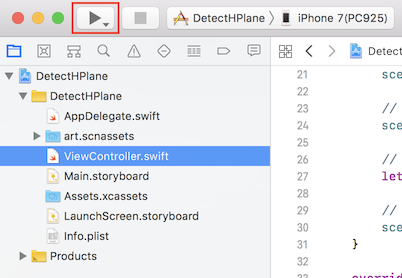

## DetectHPlane
### 概要
水平面を認識し、球を配置する。
### 作成手順  

1. Xcodeで新規プロジェクトを作成し、「Augmented Reality App」を選択。  
   

2. 任意のプロジェクト名(ここでは「DetectHPlane」)、Languageは「Swift」、Content Technologyは「SceneKit」を選択。  
SceneKit：簡単に3Dゲームを作ることができるフレームワーク  
  

3. 一旦、実行してみる。iPhone/iPadを接続し、実行ボタンを押下。  
  
カメラスルーに飛行機が表示される。  
  

4. 飛行機を削除し、水平面認識指定を追加。
